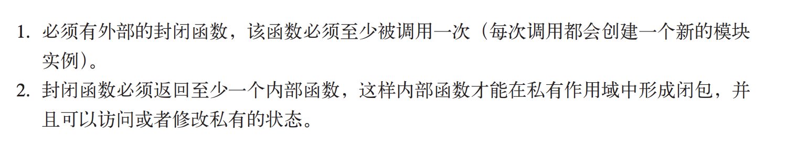

# 写着玩，练练算法，恶心的题什么的
>  
>let's start!
>  

##### es6数组解构有点问题
```
// 生成几乎有序的数组
function seqArr(n) {
    let _arr = []
    for (let i = 0; i < n; i++) {
        _arr.push(i * 2)
    }
    return _arr
}

function generateArr(n, swapTimes) {
    let arr = seqArr(n)
    let posx = 0 , posy = 0
    for (let i = 0; i < swapTimes; i++) {
        posx = Math.floor(Math.random() * n)
        posy = Math.floor(Math.random() * n)
        let temp = arr[posy]
        arr[posx] = arr[posy]
        arr[posy] = temp
        // console.log(posx, posy)
        // debugger
        // [arr[posx], arr[posy]] = [arr[posy], arr[posx]]
        // ES6这么解构交换暂时又问题不知道为啥?
    }
    return arr
}

console.log(generateArr(10, 2))
```
> 知道了问题了，万恶的js  
> 解构不成功是因为 posy = Math.floor(Math.random() * n) 没加分号

##### 手工datepicker
* [预览](https://zouhangwithsweet.github.io/xiezhewan/)
* 日期对象
> 当月第一天 new Date(year, month - 1, 1)  
> 当月最后一天 new Date(year, month, 0)  
> 星期1到日 [1, 2, 3, 4, 5, 6, 0]  
##### 函数节流(throttle)和函数防抖(debounce)

###### 函数节流就是预定一个函数只有在大于等于执行周期时才执行，周期内调用不执行。好像水滴攒到一定重量才会落下一样。
场景：
> * 窗口调整（resize）  
> * 页面滚动（scroll）  
> * 抢购疯狂点击（mousedown）  

###### 函数防抖就是在函数需要频繁触发情况时，只有足够空闲的时间，才执行一次。好像公交司机会等人都上车后才出站一样。
场景：
> * 实时搜索（keyup）  
> * 拖拽（mousemove）  

##### 拾人牙慧，研究下vue双向绑定
> [极简实现input双向绑定，也是v-model的底层原理通过监听，input事件和Object.defineProperty实现](https://zouhangwithsweet.github.io/xiezhewan/easy.html)
```
// html结构
<div>
    <input type="text" value="" id="input">
    <p>你好，<span id="nickName"></span></p>
    <div id="introduce"></div>
</div>
// script
var userInfo = {};
    var val = document.getElementById('input')
    val.addEventListener('input',() => {
        userInfo.nickName = val.value
    })
    Object.defineProperty(userInfo, "nickName", {
        get: function(){
            return document.getElementById('nickName').innerHTML;
        },
        set: function(nick){
            document.getElementById('nickName').innerHTML = nick;
        }
    });
    Object.defineProperty(userInfo, "introduce", {
        get: function(){
            return document.getElementById('introduce').innerHTML;
        },
        set: function(introduce){
            document.getElementById('introduce').innerHTML = introduce;
        }
    })
```
##### rem移动端布局

> 直接移动端写的很多，但是都是套的模板  
> 在摘抄一下移动端的rem最简单的办法(目前都是750的页面)
```
(function (doc, win) {
        var docEl = doc.documentElement,
            resizeEvt = 'orientationchange' in window ? 'orientationchange' : 'resize',
            recalc = function () {
                var clientWidth = docEl.clientWidth;
                if (!clientWidth) return;
                if(clientWidth>=640){
                    docEl.style.fontSize = '100px';
                }else{
                    docEl.style.fontSize = 100 * (clientWidth / 750) + 'px';
                }
            };

        if (!doc.addEventListener) return;
        win.addEventListener(resizeEvt, recalc, false);
        doc.addEventListener('DOMContentLoaded', recalc, false);
    })(document, window);

链接：https://www.jianshu.com/p/b00cd3506782
```
> MongoDB start

##### ES6 学习笔记
> 主要记录下不常用的ES6语法，加深记忆

* set 和 map  
 * set
    > 不能有重复项，可以运用于数组去重； `[...new Set([])]`  
    > 可以`forEach((value, key) => console.log(value, key))` 二者一致；keys()，values()，entries()  
    > size add delete has clear
    * webset 元素必须是对象，且为弱引用；垃圾回收机制引用计数无效

##### 计算机网络
* 数百万级的互联的计算设备的集合
* 网络协议（newwork protocol）
    > 数据交换的规则、标准和约定
        > * 语法（syntax），数据的结构或格式
        > * 语义（semantic）

### 18/3/2 - 18/6/30
三个计划
* 1.阅读 《你不知道的JavaScript》
* 2.nodejs入门
* 3.vue源码学习

#### vue-cli proxytable rewrite的理解
> 用代理, 首先你得有一个标识, 告诉他你这个连接要用代理. 不然的话, 可能你的 html, css, js这些静态资源都跑去代理. 所以我们只要接口用代理, 静态文件用本地.'/iclient': {}, 就是告诉node, 我接口只要是'/iclient'开头的才用代理.所以你的接口就要这么写 /iclient/xx/xx. 最后代理的路径就是 http://xxx.xx.com/iclient/xx/xx.可是不对啊, 我正确的接口路径里面没有/iclient啊. 所以就需要 pathRewrite,用''^/iclient'':'', 把'/iclient'去掉, 这样既能有正确标识, 又能在请求接口的时候去掉iclient.

#### 滚动到可视区域


```JavaScript
// 输入框在虚拟键盘弹出时，自动滚动到可见位置
document.body.addEventListener('click', function (event) {
  var element = event.target;
  var tags = {
    'INPUT': 1,
    'TEXTAREA': 1,
  }
  if ((element.tagName in tags) ) {
    setTimeout(function(){
      element.scrollIntoViewIfNeeded();
      // console.log('scrollIntoViewIfNeeded');
    }, 400);
  }
}, false);
```

#### 基于vue/el-table的可编辑表格数据管理后台

[预览地址](https://zouhangwithsweet.github.io/xiezhewan/editTable/#/dataflow)

- 脚手架基于最新的vue-cli@3
- 适用于后台接口数据发布和调试

#### 常用原生组件，message、alert、loading、confirm
[预览地址](https://zouhangwithsweet.github.io/xiezhewan/componentsCls/)
- [x] 基于ES6 class构建，支持回调函数
- [x] 监听`transitionend`监听
- [ ] 兼容差

#### webpack中路径解析问题
> ~ 视为模块解析是 webpack 做的事，不是 css-loader 做的事。
各类非 js 直接引用（import require）静态资源，依赖相对路径加载问题，都可以用 ~ 语法完美解决；
例如 css module 中： @import "~@/style/theme"
css 属性中： background: url("~@/assets/xxx.jpg")
html 标签中： ``
如果找不到alias的配置，～直接会被解析到node-modules

#### 内联替换元素 img 可以通过设置 max-width max-height 以及父元素 flex实现自适应居中

#### 古诗词


### v-tip 第一次进入该页面给与新功能提示
```js
export default {
  inserted(el, binding) {
    if (window.localStorage.getItem('kp-meTips')) return
    // clone node
    const HEIGHT = document.documentElement.clientHeight
    const rect = el.getBoundingClientRect()
    const faker = el.cloneNode(true)
    faker.style.marginTop = `${rect.top}px`
    faker.setAttribute('style',
      `position: absolute;
      top: ${rect.top}px;
      width: 100%;
      border: 1px solid #F99E22;
      box-shadow: 0 0 2px 0 #F99E22, 0 0 4px 0 #F8E71C;
      border-radius: 4px;
      transform: scale(.97);
      `)
    // add mask
    const mask = document.createElement('div')
    mask.classList.add('tip-mask')
    // add text
    const textContainer = document.createElement('div')
    textContainer.innerText = binding.value
    textContainer.classList.add('tip-text')
    textContainer.setAttribute('style', `bottom: ${HEIGHT - rect.top}px;`)
    // add maskarrow
    const arrow = document.createElement('div')
    arrow.classList.add('tip-arrow')

    textContainer.appendChild(arrow)
    mask.appendChild(textContainer)
    mask.appendChild(faker)
    // add removehandler
    mask.addEventListener('click', function() {
      const parent = mask.parentNode
      parent.removeChild(this)
    })
    document.body.appendChild(mask)
    // 默认只提示一次
    window.localStorage.setItem('kp-meTips', '1')
  },
}
```

### vue 组见监听 hook
```js
<child
  @hook:beforeCreate="handleChildBeforeCreate"
  @hook:created="handleChildCreated"
  @hook:mounted="handleChildMounted"
  @hook:生命周期钩子
 />
```

#### 闭包
一个函数b() 保持对一个函数的作用域的引用，这个引用就是闭包。
闭包包装模块


### webpack 异步加载原理
[JSONP](https://segmentfault.com/a/1190000011435407)

#### input change 事件区别
- input 即刻触发 change 失焦判断是否更改触发
- file的时候最好使用change，否则无法捕捉到完整文件

#### 赋值运算符 “ = ”
JavaScript 赋值运算符返回的值是被赋予的值

```Javascript
    let a = 0 // => 返回值是 0
```

### 递归的思想
> 我们已经写了不少递归了，也许你已经发觉了其中的固定模式：先定义一个边界条件，再定义个函数，让它从一堆元素中取一个并做点事情后，把余下的元素重新交给这个函数。 这一模式对 List、Tree 等数据结构都是适用的。例如，sum 函数就是一个 List 头部与其尾部的 sum 的和。一个 List 的积便是该 List 的头与其尾部的积相乘的积，一个 List 的长度就是 1 与其尾部长度的和. 等等  

```hs
    quickSort :: (Ord a) => [a] -> [a]
    quickSort [] = []
    quickSort (x:xs) =
    let smallSorted = quickSort [a | a <- xs, a <= x]
        biggerSorted = quickSort [a | a <- xs, a > x]
    in smallSorted ++ [x] ++ biggerSorted

    quickSort' :: (Ord a) => [a] -> [a]
    quickSort' [] = []
    quickSort' (x:xs) =
    smallSorted ++ [x] ++ biggerSorted
    where smallSorted = quickSort' [a | a <- xs, a <= x]
          biggerSorted = quickSort' [a | a <- xs, a > x]
```

#### 1px border
```stylus
border-1px($color)
  position: relative
  &:after
    display: block
    position: absolute
    left: 0
    bottom: 0
    width: 100%
    border-top: 1px solid $color
    content: ' '

@media (-webkit-min-device-pixel-ratio: 1.5),(min-device-pixel-ratio: 1.5)
  .border-1px
    &::after
      -webkit-transform: scaleY(0.7)
      transform: scaleY(0.7)

@media (-webkit-min-device-pixel-ratio: 2),(min-device-pixel-ratio: 2)
  .border-1px
    &::after
      -webkit-transform: scaleY(0.5)
      transform: scaleY(0.5)
```

#### on-click in Vue jsx
**onClick** or **nativeOnClick** 
```jsx
<div on-click={this.handler}>
</div>
// with arguments, you should use a arrow function
// also you can use this.handler.bind(this, ...args)
<div on-click={() => this.handler(args)}>
</div>
```

#### 使用 toLocalString 格式化货币

```ts
let price = 1024;
price.toLocalString(); // 1,024

price = 1669999
price.toLocalString('en-IN'); // 印度 1,66,999

// 使用 options 参数
price = 2499;
price.toLocaleString('en-IN', {
  style: 'currency',
  currency: 'INR'
}); // ₹ 2,499.00

// currency 表示货币
price = 2499;
price.toLocaleString('en-IN', {
  style: 'currency',
  currency: 'INR',
  minimumFractionDigits: 0
});
// => "₹ 2,499"
/**
 * style：可选值为 decimal（小数）、currency（货币）或 percent（百分比）
 * currency: 货币符号
 */
```
[MDN文档](https://developer.mozilla.org/zh-CN/docs/Web/JavaScript/Reference/Global_Objects/Number/toLocaleString)

#### Intl 对象

Intl 对象是 ECMAScript 国际化 API 的一个命名空间，它提供了精确的字符串对比、数字格式化，和日期时间格式化。Collator，NumberFormat 和 DateTimeFormat 对象的构造函数是 Intl 对象的属性。本页文档内容包括了这些属性，以及国际化使用的构造器和其他语言的方法等常见的功能。

[MDN文档](https://developer.mozilla.org/zh-CN/docs/Web/JavaScript/Reference/Global_Objects/Intl)

### 轮询封装

使用 `setTimeout` 递归来代替 `setInterval`；一避免函数执行时间过长，导致 `setInterval` 跳过的现象。
```ts
// 轮询函数结果
const polling = async (
  func: Function,
  assert: (resp: any) => boolean,
  count = 8,
  interval = 2000
) => {
  /**
   * 函数结果
   */
  let resp: any = null
  /**
   * 计时器 Id
   */
  let id: any = null
  /**
   * 内部计数
   */
  let _count = 0
  // ------------------------------ 返回值用 promise 包裹一下 ------------------------------
  return new Promise(async (resolve, reject) => {
    // 轮询方法
    async function cstmInterval(
      func: Function,
      interval: number
    ) {
      if (_count === count) {
        // 次数到了就不执行
        clearCstmInterval(id)
        resolve(resp)
        return
      }
      id = window.setTimeout(async () => {
        try {
          resp = await func()
          _count++
          if (!assert(resp)) {
            cstmInterval(func, interval)
          } else {
            clearCstmInterval(id)
            resolve(resp)
          }
        } catch (error) {
          reject(error)
        }
      }, interval)
    }
    // 清除计时器方法
    function clearCstmInterval(id: any) {
      window.clearTimeout(id)
    }
    // 执行第一次
    try {
      const resp_first = await func()
      _count++
      if (!assert(resp_first)) {
        cstmInterval(func, interval)
      } else {
        resolve(resp_first)
      }
    } catch (error) {
      reject(error)
    }
  })
}

export { polling }
```